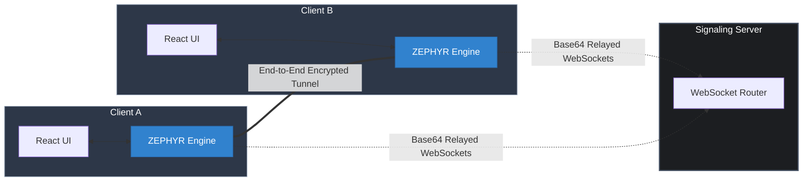
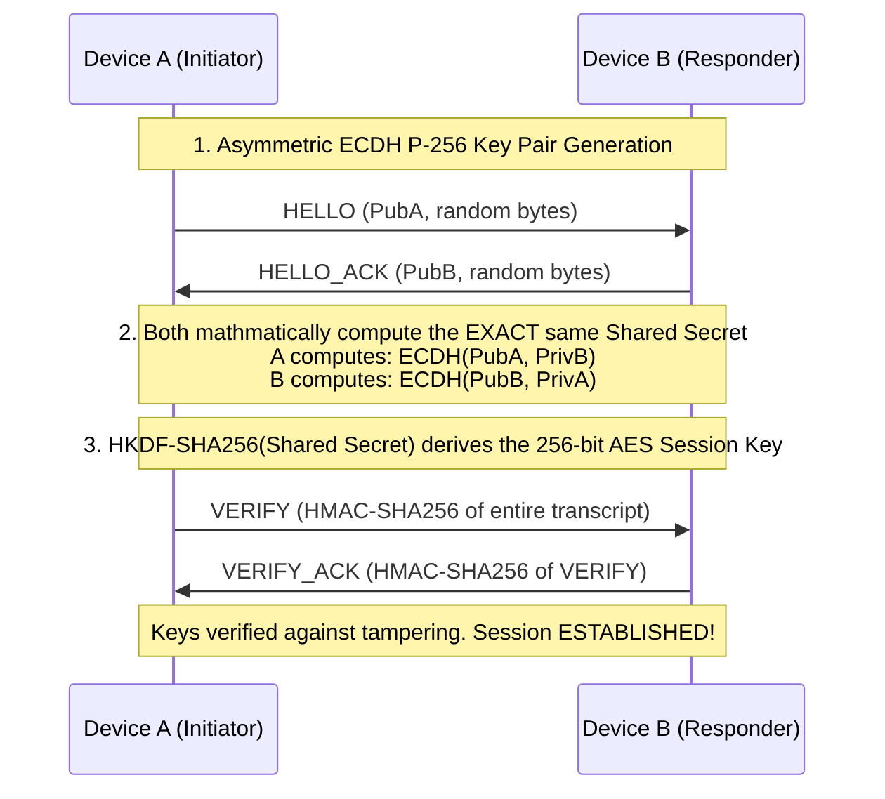

# WindWhisper P2P (ZEPHYR-1 Protocol)

**WindWhisper** is a highly secure, high-performance Peer-to-Peer (P2P) file transfer application. It is designed to allow two devices to securely send large files directly to each other using absolute End-to-End Encryption (E2EE), completely preventing the signaling server from ever seeing or intercepting your file contents.

## 🚀 Features
- **End-to-End Encrypted (E2EE):** Employs Elliptic-Curve Diffie-Hellman (ECDH P-256) key exchange to derive symmetric AES-256-GCM keys. 
- **Custom Binary Protocol (ZEPHYR-1):** A custom transport protocol built for extreme speed that prevents buffer bloat and enables verifiable file integrity using SHA-256.
- **Sliding Window Congestion Control:** Implements Automatic Repeat reQuest (ARQ) with windowing to maximize throughput without crashing the browser or the socket on large files.
- **Zero Disk Spooling:** Files stream directly from memory-to-memory using advanced HTML5 Blob mapping and the modern Native File System Access APIs (`showSaveFilePicker`).
- **Completely Private Server:** The signaling Node.js + WebSocket server exists purely to route base64-encoded encrypted packet blobs to endpoints. It inherently cannot read or modify the stream.

---

## 🏗️ System Design

The project is split into two lightweight systems:
1. **The Signaling Server (`/server`):** A Node.js + WebSocket backend. Provides a central registry where devices announce their online presence.
2. **The React Client (`/client`):** A Vite-powered React front-end application executing the heavy cryptographic and chunking logic.



### Cryptographic Handshake Workflow
Instead of sending raw files over WebSockets—or implicitly trusting a TLS termination proxy—WindWhisper handles its own native encryption. Before a file transfer can begin, the two peers dynamically negotiate session keys:



**Key Steps:**
1. **HELLO / HELLO_ACK:** Exchange randomly generated P-256 Elliptic Curve Public Keys over the open WebSocket. 
2. **ECDH Key Derivation:** Using the peer's public key and their own private key, independently compute the Shared Secret.
3. **HKDF Expansion:** Extract a hardened `Session Key` perfectly sized for AES.
4. **VERIFY / VERIFY_ACK:** Sign the transcript using HMAC-SHA256 to prove ownership of the keys.

### Transfer Workflow
Once keys are synchronized via the Handshake, the sender slices the file into bite-sized 64 KB fragments:

```mermaid
sequenceDiagram
    participant S as Sender
    participant R as Receiver
    
    Note over S: Computes absolute SHA-256 hash of entire file
    S->>R: META (filename, totalChunks, sha256hex)
    R-->>S: ACK (seq 0)
    
    Note over S: File slicing initiates (64 KB fragments)
    rect rgb(30, 40, 50)
        Note over S: Sliding Window Pipeline [Capacity: 32 chunks]
        S->>R: DATA (chunkIndex: 0) AES-GCM Encrypted
        S->>R: DATA (chunkIndex: 1) AES-GCM Encrypted
        S->>R: DATA (chunkIndex: 2) AES-GCM Encrypted
        R-->>S: ACK (seq 1)
        Note over S: Window advances, unlocking next queued chunk
        S->>R: DATA (chunkIndex: 3) AES-GCM Encrypted
        R-->>S: ACK (seq 2)
        R-->>S: ACK (seq 3)
    end
    
    Note over R: Downloads chunks, AES deciphers natively, and sequentially <br/>re-assembles them into array buffers in active memory space.
    Note over R: Validates final unified file via original META SHA-256 <br/>to guarantee bit-for-bit uncorrupted file integrity!
    Note over R: Triggers Native Save File / Browser Download
```



**Key Steps:**
1. **META Packet:** Transmit a `META` packet containing the filename, size, chunk count, and SHA-256 hash.
2. **DATA Slicing:** Stream slice-by-slice. Each 64 KB slice is prepended with its explicit `chunkIndex` identifier.
3. **AES-GCM Authenticated Encryption:** The chunk is encrypted using the negotiated Session Key safely inside `crypto.subtle`. The GCM algorithm appends an authentication tag to mathematically block tampering.
4. **Windowed Dispatch:** Inject up to 32 chunks into the WebSocket (Sliding Window ARQ) and gracefully suspend memory allocation until unencrypted `ACK` responses open the window.
5. **Decryption & Reassembly:** Download, decrypt, map via `chunkIndex`, and finally validate the entire concatenated file against the `META` hash.

---

## 💻 Tech Stack
- **Frontend:** React 18, Vite, TypeScript, Vanilla CSS
- **Cryptographic Engine:** Browser Native `window.crypto.subtle` API
- **File System:** HTML5 Blob API, File API, Native OS System Access API
- **Signaling:** Node.js, `ws` (Raw WebSockets), `bonjour-service` (Local mDNS Discovery)

---

## 🏃 Getting Started (Local Setup)

### 1. Run the Signaling Server
Navigate to the `server` directory and install the necessary dependencies:
```bash
cd server
npm install
node index.js
```
*The server will spin up on `ws://localhost:7473`.*

### 2. Run the React Client
Open a new terminal window, navigate to the `client` directory, and start the Vite dev server:
```bash
cd client
npm install
npm run dev
```

### 3. Usage
- Open `http://localhost:5173` in two different browser tabs (or on a different computer connected to your local network).
- Select your target device from the peer list.
- Click **"Connect"**. Once connected smoothly (represented by the green dot), the session keys are permanently locked in.
- Drag & Drop any file into the circle area to transfer the file seamlessly peer-to-peer!

---

## 📂 File Structure (Key Elements)
```text
/
├── server/
│   ├── index.js          # Core WS instance and mDNS setup
│   └── rooms.js          # Lightweight connection routing & peer registry
├── client/
│   ├── src/components/   # Pure React presentation (Mascot, Upload Circles, etc)
│   ├── src/hooks/        # The glue executing the protocol logic (useZephyr.ts)
│   ├── src/modes/        # Main WindWhisper UI Page 
│   ├── src/protocol/     # The Core ZEPHYR-1 Engine!
│   │   ├── handshake.ts  # Executes the P-256 ECDH protocol and HKDF expansions
│   │   ├── zephyr.ts     # The Main Protocol Router / State Machine
│   │   ├── crypto.ts     # Native AES-GCM Subroutines
│   │   ├── chunker.ts    # FileSlicer, Blob ArrayBuffer mappings and SHA-256 logic
│   │   └── packet.ts     # Binary Buffer Struct logic 
```

> **Note on Client Privacy:** The transfer is entirely browser-dependent. If the browser tab is refreshed or closed, the volatile session keys are obliterated from RAM instantly, securely destroying the file pipeline.
