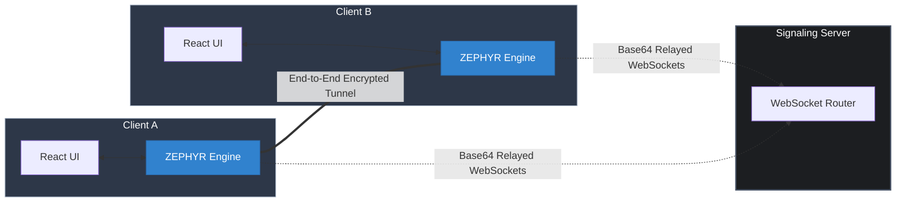
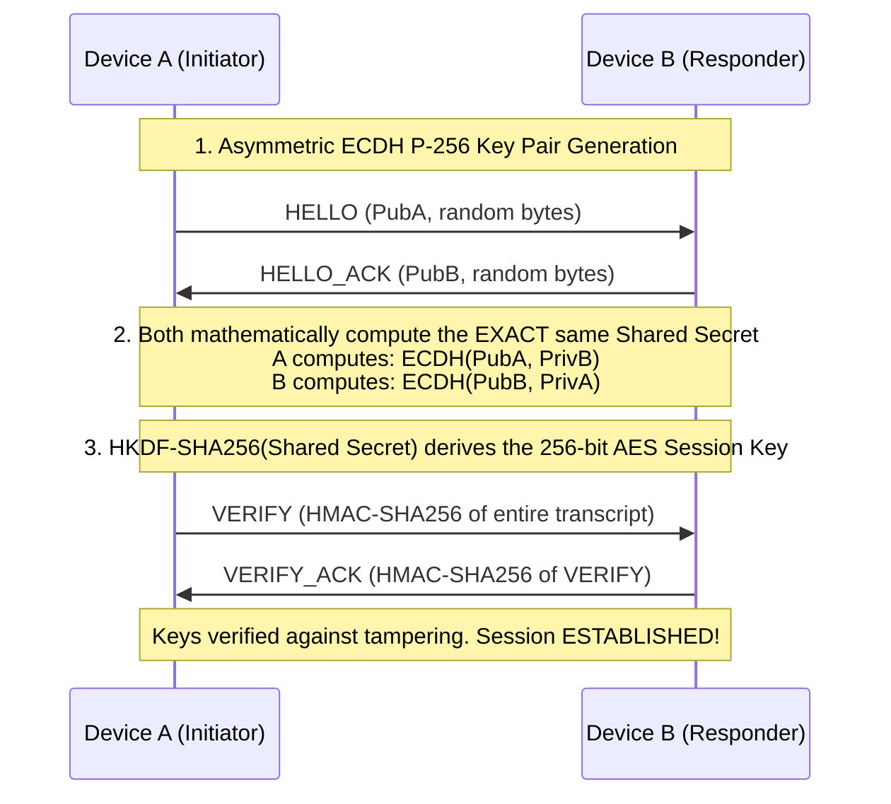

# Research Paper Diagrams (Mermaid)

Copy and paste the code blocks below into any Mermaid renderer (like [Mermaid Live Editor](https://mermaid.live/), Notion, or GitHub) to export high-quality image files for your research paper.

## 1. System Architecture Diagram
This diagram shows the stateless signaling server routing traffic between the two clients.

## 2. Cryptographic Handshake Sequence
This diagram proves exactly how Device A and Device B generate their keys and lock the AES session.

## 3. Data Transfer & Sliding Window Protocol
This sequence diagram visually demonstrates the ZEPHYR-1 chunking and ARQ window protocol.

```mermaid
sequenceDiagram
    participant S as Sender
    participant R as Receiver
    
    Note over S: Computes absolute SHA-256 hash of entire file
    S->>R: META (filename, totalChunks, sha256hex)
    R-->>S: ACK (seq 0)
    
    Note over S: File slicing initiates (64 KB fragments)
    rect rgb(30, 40, 50)
        Note over S: Sliding Window Pipeline [Capacity: 32 chunks]
        S->>R: DATA (chunkIndex: 0) AES-GCM Encrypted
        S->>R: DATA (chunkIndex: 1) AES-GCM Encrypted
        S->>R: DATA (chunkIndex: 2) AES-GCM Encrypted
        R-->>S: ACK (seq 1)
        Note over S: Window advances, unlocking next queued chunk
        S->>R: DATA (chunkIndex: 3) AES-GCM Encrypted
        R-->>S: ACK (seq 2)
        R-->>S: ACK (seq 3)
    end
    
    Note over R: Downloads chunks, AES deciphers natively, and sequentially <br/>re-assembles them into array buffers in active memory space.
    Note over R: Validates final unified file via original META SHA-256 <br/>to guarantee bit-for-bit uncorrupted file integrity!
    Note over R: Triggers Native Save File / Browser Download
```

