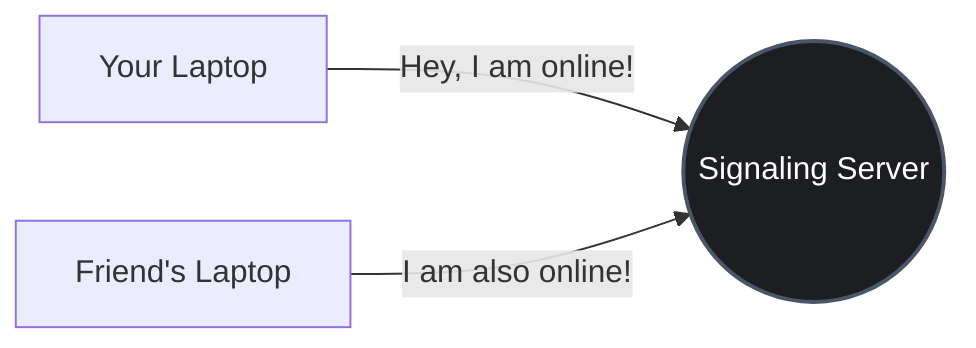
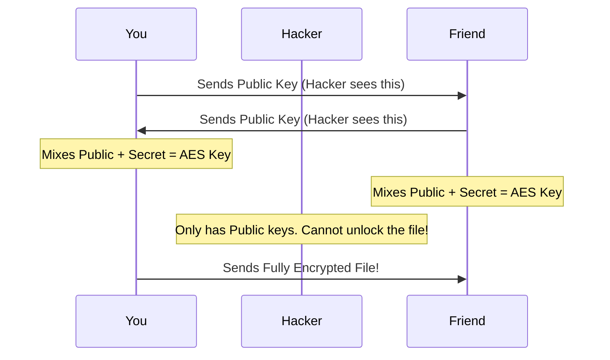
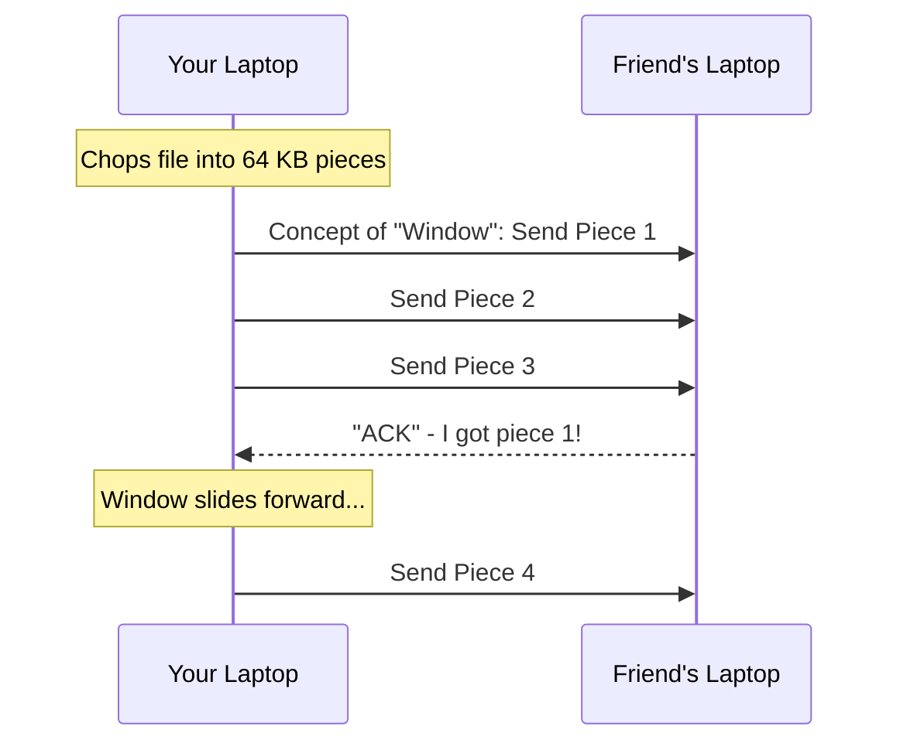

# Methodology and System Design

*Written for a 1st-Year B.Tech Computer Science Student.*

Imagine you want to send a massive 2 GB movie to your friend sitting right next to you in class. Currently, if you use WhatsApp or Google Drive, your movie travels all the way from your laptop, hits a server in a different country, and then travels all the way back down to your friend's laptop. That is slow, wastes internet bandwidth, and means a massive tech company got to look at your file.

Our project, **WindWhisper** (and its super-secure mode, **Kabutar**), completely changes this. We built a system where the file travels directly through the air from your laptop straight into your friend's laptop. 

Here is exactly how we designed the system, step-by-step.

---

## 1. The Signaling Server (The Post Office)
Even though the file travels directly between you and your friend, your laptops initially need a way to say, *"Hey, what's your IP address so I can connect to you?"* 

To solve this, we built a **Signaling Server** using Node.js and WebSockets. Think of this server like a very dumb Post Office.
- It does **not** have a database.
- It does **not** have a hard drive to save your files. 
- It simply takes a message from you and immediately throws it to your friend. 

### How do we find the server? (mDNS)
Normally, you have to type in an IP address to find a server. But we use a technology called **mDNS (Multicast DNS)**. It works like magic: your laptop essentially shouts into the local college Wi-Fi, *"Is there a Signaling Server in this room?"* and the server replies *"Yes, I'm right here!"* This means the user never has to type an IP address. It is "Zero-Configuration."

---

## 2. The Identity Problem (Kabutar Mode)
Because we are on a college Wi-Fi, what happens if an evil hacker sitting in the back row pretends to be your friend? If you casually click "Send", you might accidentally send your private file to the hacker!

To stop this, we created **Kabutar Mode**. Kabutar uses a concept called **TOTP (Time-Based One-Time Password)**.

1. Your laptop generates a random 6-digit code on the screen (e.g., `834912`).
2. Your friend looks at your physical laptop screen with their human eyes, reads the code, and types it into their laptop.
3. Because the hacker cannot physically see your screen, they cannot guess the 6-digit code. We have now mathematically proven that the person receiving the file is physically sitting next to you!

---

## 3. The Security Handshake (Mixing the Paint)
Now that we know who we are talking to, we need to lock the connection so the hacker can't listen in. We use a famous algorithm called **ECDH (Elliptic-Curve Diffie-Hellman)**.

Imagine it like mixing paint:
- You generate a secret color (Blue) and a public color (Yellow).
- Your friend generates a secret color (Red) and a public color (Yellow).
- You trade **public colors** over the Wi-Fi. The hacker sees the Yellow paint travelling through the air.
- Once you receive your friend's public color, you mix it with your secret color. Because math is awesome, both you and your friend end up with the exact same final mixed color (let's say, Green).
- The hacker only saw "Yellow" cross the network, so they have no idea the final secret is Green!

That "Green" color becomes our **AES-256 Session Key**. Every single byte of your movie file is locked inside a digital safe using this key.

---

## 4. The Data Conveyor Belt (ZEPHYR-1 Protocol)
You cannot shove a 2 GB file through the Wi-Fi all at once. It will crash the browser. 

So, we built our own custom set of rules called the **ZEPHYR-1 Protocol**. It uses something called a **Sliding Window Protocol**.

Imagine you have a giant pile of 10,000 bricks to move, but your conveyor belt can only hold **32 bricks** at a time before it breaks string. 
1. We chop your movie file into tiny 64 KB pieces. 
2. We place exactly 32 pieces onto the network conveyor belt. 
3. We stop and wait.
4. When your friend successfully downloads Piece #1, they shout back *"ACK!"* (Acknowledged). 
5. The moment we hear "ACK," we are allowed to place Piece #33 onto the belt.

This sliding window means the network is always operating at 100% maximum speed, but absolutely never overflows or crashes your computer's RAM.

## Conclusion: The Final User Experience
For the user, they don't have to know about AES encryption, mDNS, or Sliding Windows! 
From their perspective:
1. They open a webpage.
2. They see their friend's name pop up automatically.
3. They drag and drop a file onto a circle. 
4. The file instantly transfers at gigabit speeds without ever leaving the room. 

It is incredibly simple on the outside, but relies on beautiful, complex computer science on the inside!
