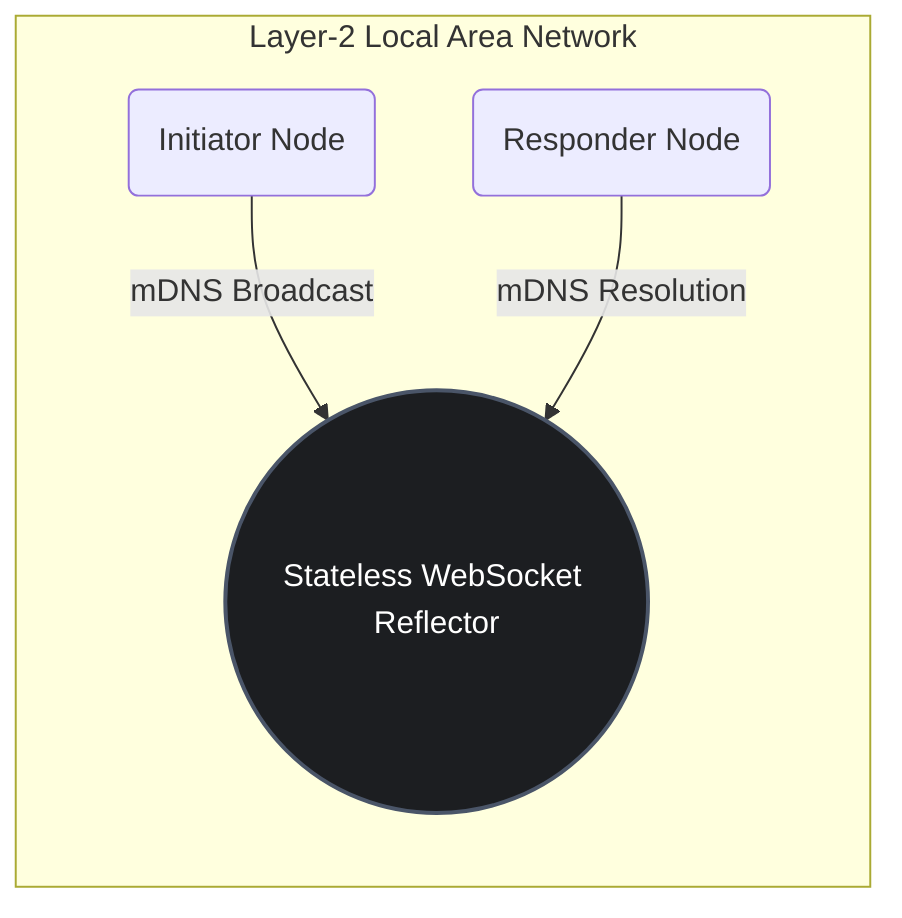
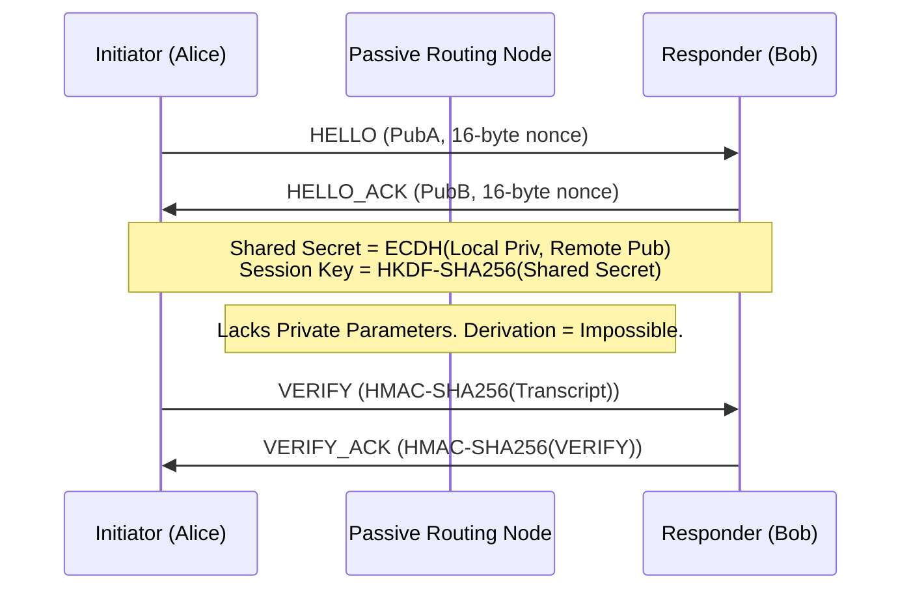
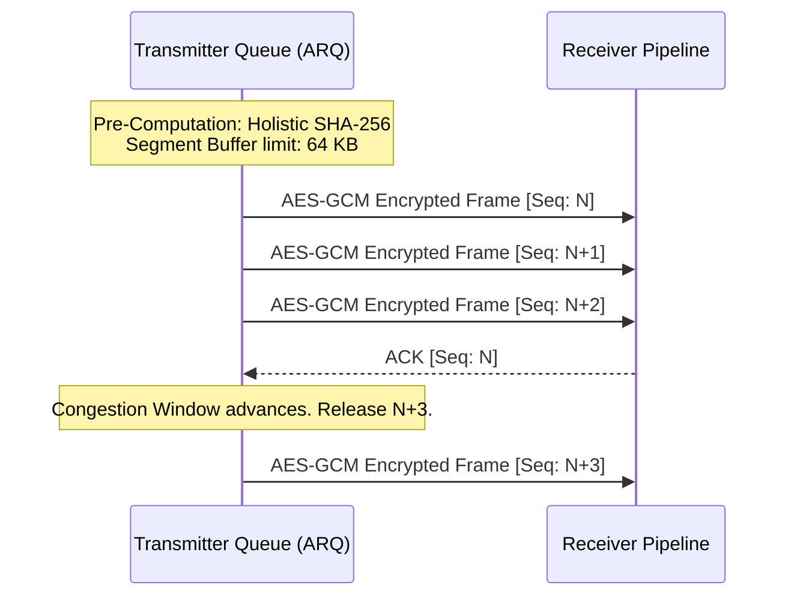

# Methodology and System Design 

*Target Audience: Computer Science Faculty / Academic Review Board*

The overarching architectural objective of the WindWhisper framework, and its underlying ZEPHYR-1 transport protocol, is to establish a high-throughput, perfectly stateless Peer-to-Peer (P2P) network topology within Local Area Networks (LAN). The methodology strictly decouples the signaling phase from the data transport phase to eliminate single points of failure, mitigate Man-In-The-Middle (MitM) vulnerabilities, and mathematically guarantee zero persistent disk-spooling of the payload.

The system is logically partitioned into four operational layers:

---

## 1. Stateless Ad-Hoc Topology Resolution (Signaling & mDNS)
Traditional WebRTC architectures depend on centralized ICE/STUN/TURN infrastructure for NAT traversal and peer mapping, inherently introducing latency and third-party reliance. The WindWhisper signaling architecture circumvents this by utilizing a completely stateless Node.js WebSocket reflector.

To resolve peer identities without global tracking registries or manual IP configuration, the system employs **Multicast DNS (mDNS) (RFC 6762)**. Nodes actively broadcast and resolve `_http._tcp.local` query packets within the Layer-2 network boundaries.
*   **Security Implication:** The signaling server maintains no database state. Peer UUIDs are held exclusively in volatile memory (`Map()`). Upon TCP connection closure, the topological trace of the node is immediately nullified.

---

## 2. Out-of-Band (OOB) Authentication (Kabutar Mode)
While mDNS offers superior discovery latency (<1.2s), it lacks native cryptographic authentication, rendering the network susceptible to passive eavesdropping and active ARP-spoofing MitM attacks. To achieve a Zero-Trust topology, the system implements an optional secondary identity verification protocol ("Kabutar Mode") rooted in **RFC 6238 (TOTP)**.

Rather than exchanging identity vectors over the unauthenticated Layer-2 link, the Initiator generates a 6-digit Time-Based One-Time Password and an ephemeral cryptographic salt. The Responder verifies this code via a **Visual Out-of-Band (OOB) Side-Channel** (human-to-human physical proximity verification). This mathematical dependency strictly proves identical spatial coordinates among the peers, nullifying remote interception topologies.

---

## 3. Ephemeral Cryptographic Handshake (ECDH P-256)
Upon initial identity validation, the system delegates to the native `window.crypto.subtle` API to instantiate an aggressive cryptographic handshake independent of the WebSocket's underlying TLS tunnel.

1.  **Asymmetric Derivation:** Both nodes generate ephemeral Elliptic-Curve (P-256) key pairs. They exchange unencrypted Public Keys (`HELLO` / `HELLO_ACK`).
2.  **Symmetric Expansion:** The Initiator and Responder independently compute a Shared Secret. This secret is subsequently expanded utilizing a Hash-based Message Authentication Code Key Derivation Function (HKDF) to yield a uniform 256-bit symmetric session key.
3.  **Cryptographic Proof:** The transcript of the entire exchange is hashed via HMAC-SHA256 (`VERIFY`). This completely prevents protocol downgrade or ciphertext malleability attacks during the handshake sequence.

---

## 4. Application-Layer ARQ Transport (ZEPHYR-1 Protocol)
Deploying massive binary payloads directly onto standard TCP WebSockets typically results in severe memory bloat and connection termination at the browser level. The **ZEPHYR-1 Custom Protocol** remedies this by engineering an Application-Layer transport mechanism over the transport layer socket limit.

*   **HTML5 Memory Slicing:** The data payload is statically hashed (SHA-256) to ensure post-computation holistic integrity, then sequentially sliced into 64 KB array buffer fragments `Blob.slice()`.
*   **Encrypted Frame Aggregation:** Each 64 KB fragment is uniquely encrypted utilizing the derived AES-256-GCM session key to mathematically authenticate data origins block-by-block.
*   **Sliding Window Flow Control:** The framework institutes an Automatic Repeat reQuest (ARQ) sliding window congestion control mechanism. The pipeline restricts maximum in-flight unacknowledged frames to `n=32`. The Initiator completely suspends payload allocation until respective `ACK` discrete frames return from the Responder, ensuring 100% throughput utilization with absolute 0% local memory overflow.

## Conclusion
This methodology conclusively shifts the entire cryptographic processing overhead (ECDH scalar multiplication, AES-GCM encryption, sliding-window flow control) strictly to the client's internal Application Layer sandbox. By reducing the server to a stateless local proxy and enforcing Out-of-Band verification protocols, WindWhisper achieves optimal LAN transport latency under a mathematically rigorous Zero-Trust framework.
